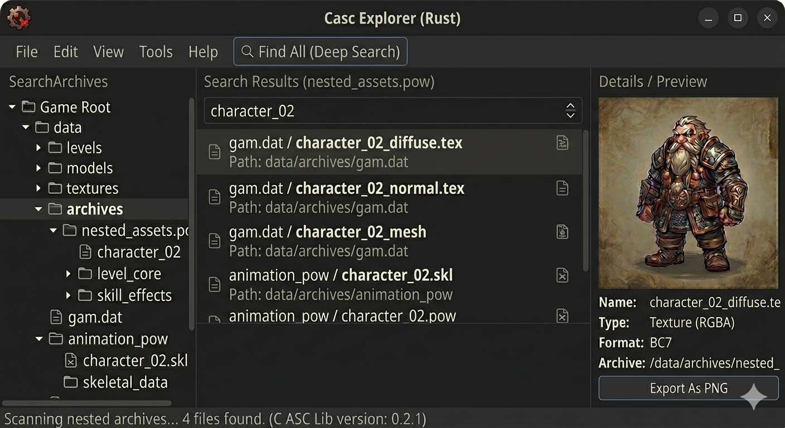

# Rusty Demon — Cross-Platform CASC Explorer

A fast, cross-platform explorer for CASC (Content-Addressable Storage Container)
archives, written entirely in Rust.

> **For personal and educational use only.**

[](https://github.com/jabberwock/rustydemon/actions/workflows/ci.yml)

---

## UI Preview



*Three-panel layout: archive tree (left) · search results (centre) · file details and texture preview (right)*

---

## Platform Screenshots

| Windows | macOS |
|---------|-------|
| *screenshot coming once tested* | *screenshot coming once tested* |

| Linux | Steam Deck |
|-------|-----------|
| *screenshot coming once tested* | *screenshot coming once tested* |

> PRs with real screenshots welcome — build instructions are below.

---

## Features

- **Regedit-style global search** — searches *every* entry in the archive manifest,
  not just the currently selected folder
- **File tree navigation** — browse archives by folder with expand/collapse, Expand All / Collapse All
- **BLP texture preview** — decodes BLP0 / BLP1 / BLP2 directly in the preview panel (palette, DXT1/3/5, ARGB, JPEG)
- **Export as PNG** — one click via a native save dialog
- **Deep search** — optionally search *inside* container files (`.pow` D4 skill data supported; plug-in interface for more)
- **Auto product detection** — reads `.build.info` so you never need to know internal product codes (`fenris`, `wow`, …)
- **Cross-platform** — Windows · macOS · Linux · Steam Deck (touch-ready via egui)

---

## Quick Start

### Prerequisites

| Platform | Requirement |
|----------|-------------|
| All | [Rust stable toolchain](https://rustup.rs) (1.80+) |
| Linux / Steam Deck | `libgtk-3-dev` (or equivalent) — see below |
| Windows / macOS | Nothing extra; eframe bundles everything |

**Linux / Steam Deck system deps:**

```bash
# Debian / Ubuntu / Kali
sudo apt install libgtk-3-dev libxcb-render0-dev libxcb-shape0-dev \
                 libxcb-xfixes0-dev libxkbcommon-dev libssl-dev

# Arch
sudo pacman -S gtk3 libxcb xkbcommon openssl

# Fedora
sudo dnf install gtk3-devel libxcb-devel libxkbcommon-devel openssl-devel
```

### Build & Run

```bash
git clone https://github.com/jabberwock/rustydemon.git
cd rustydemon
cargo run --release -p rustydemon
```

The first build downloads and compiles all dependencies (~3–5 minutes).
Subsequent builds are incremental and much faster.

---

## Usage Guide

### 1 — Open a game directory

**File → Open Game Directory…** and select your game's installation root
(the folder that contains `.build.info`).

The product UID is detected automatically:

| Game | Detected as |
|------|------------|
| World of Warcraft | `wow` |
| Diablo IV | `fenris` |
| Diablo III | `d3` |
| Hearthstone | `hs` |
| Heroes of the Storm | `hero` |
| StarCraft II | `s2` |
| Overwatch | `pro` |

### 2 — Load a listfile *(optional but recommended)*

Without a listfile, files are shown by hash only.
With one, the full virtual path is resolved and the tree is populated.

**File → Load Listfile…** and pick a community listfile (CSV or plain text).
A maintained listfile can be downloaded from the
[wowdev community listfile](https://github.com/wowdev/wow-listfile) project.

### 3 — Search

Type a filename fragment in the search bar and press **Enter** or click **Search**.
Results are drawn from the *entire* root manifest — every locale, every content
variant — so nothing is hidden behind an unexpanded folder.

### 4 — Deep search *(optional)*

Check **Deep search** and click **🔍 Find All (Deep Search)** to also search
*inside* supported container files:

| Format | What is indexed |
|--------|----------------|
| `.pow` | D4 skill/power definitions, SF names, damage formulas |
| *(more formats via the plug-in interface)* | |

### 5 — Preview and export

Click any file in the tree or search results to load it into the preview panel.

- **BLP textures** render inline
- **All other files** show a hex dump of the first 256 bytes
- **Export As PNG** saves a decoded BLP to disk via a native dialog

---

## Workspace Layout

```
rustydemon/
├── rustydemon-blp2/   BLP0/1/2 texture decoder (palette, DXT1/3/5, ARGB, JPEG)
├── rustydemon-lib/    CASC library (config, index, encoding, BLTE, root, search)
└── rustydemon/        egui/eframe GUI application
```

---

## Contributing

1. Fork and create a feature branch
2. `cargo test --workspace` must pass
3. `cargo fmt --all` and `cargo clippy --workspace -- -D warnings` must be clean
4. Open a PR — CI runs fmt, clippy, tests, and a RustSec security audit automatically

Platform screenshots, listfile improvements, and new deep-search plug-ins are
especially welcome.

---

## License

Licensed under [AGPL-3.0](./LICENSE) with the Commons Clause.
