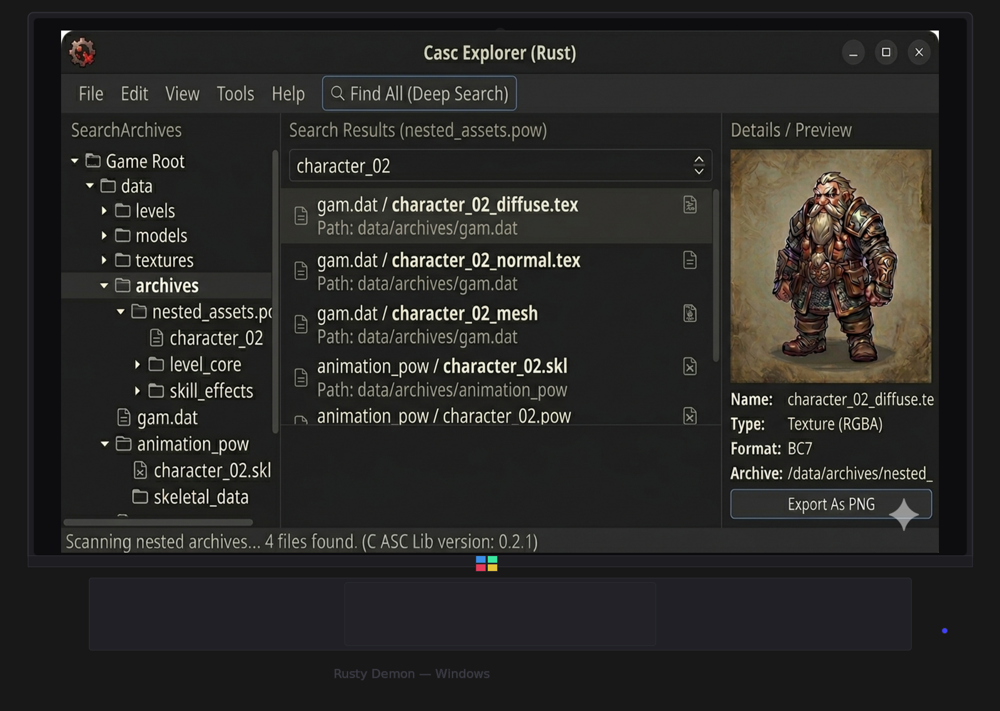
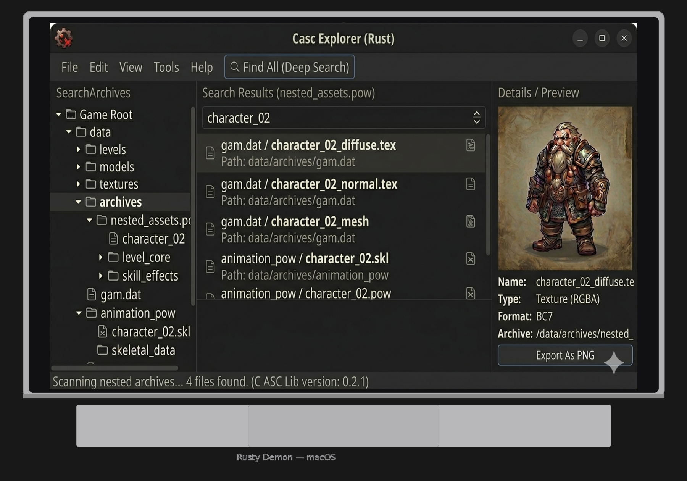
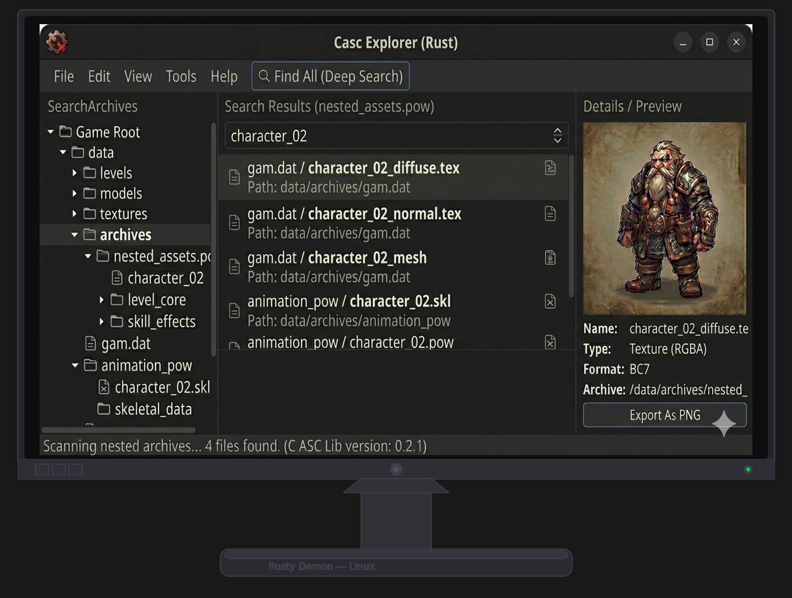
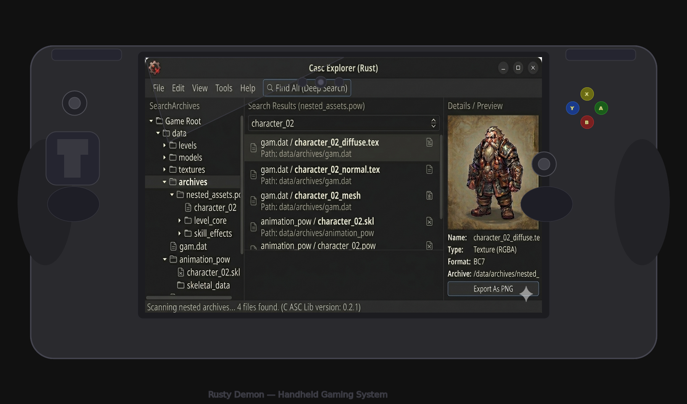

# Rusty Demon — Cross-Platform CASC Explorer

A fast, cross-platform explorer for CASC (Content-Addressable Storage Container)
archives, written entirely in Rust.

> **Rusty Demon is the first tool of any kind — proprietary or open source —
> that can read the Steam-distribution CASC static container format used by
> Diablo IV.** Neither CascLib nor the original TACTLib implementation handles
> the full Steam D4 layout (key-layout flags, zlib VFS roots, meta.dat /
> payload.dat distinction); rustydemon does. See
> [Steam D4 Support](#steam-d4-support) below.

> **For personal and educational use only.**

[](https://github.com/HoldMyBeer-gg/rustydemon/actions/workflows/ci.yml)
[](https://www.rust-lang.org)
[](https://doc.rust-lang.org/edition-guide/rust-2021/index.html)
[](./LICENSE)
[](#platform-screenshots)
[](#steam-d4-support)

---

## UI Preview


*Three-panel layout: archive tree (left) · search results (centre) · file details and texture preview (right)*

---

## Platform Screenshots

| Windows | macOS |
|---------|-------|
|  |  |

| Linux | Handheld (Steam Deck, ROG Ally, etc.) |
|-------|---------------------------------------|
|  |  |

> PRs with real screenshots welcome — build instructions are below.

---

## Features

- **Regedit-style global search** — searches *every* entry in the archive manifest,
  not just the currently selected folder
- **File tree navigation** — browse archives by folder with expand/collapse, Expand All / Collapse All
- **Pluggable preview panel** — formats register themselves through a
  [`PreviewPlugin`](rustydemon/src/preview/mod.rs) trait. Built-in plugins
  cover BLP textures (WoW), `.tex` BC textures (D4), `.pow` skill data (D4),
  `.vid` Bink Video 2 movies (D4), and a generic UTF-8 text fallback. Add a
  format by dropping one file into `rustydemon/src/preview/`.
- **Pluggable export buttons** — each preview plugin can register its own
  export actions (e.g. *Export As PNG* for textures, *Export As BK2* for
  movies). Raw export is always available as a fallback.
- **Deep search** — optionally search *inside* container files via a parallel
  [`ContentSearcher`](rustydemon/src/deep_search/mod.rs) plug-in interface
  (`.pow` D4 skill data supported out of the box).
- **Auto product detection** — reads `.build.info` so you never need to know internal product codes (`fenris`, `wow`, …)
- **Cross-platform** — Windows · macOS · Linux · Steam Deck (touch-ready via egui)
- **Steam Diablo IV support** — first-ever reader for the Steam-distribution
  static container format (no `.build.info`, no encoding file, location
  encoded directly in each EKey)

---

## Steam D4 Support

Rusty Demon is, to the best of our knowledge, the **first publicly-available
tool** — free, paid, or otherwise — that can open the Steam distribution of
Diablo IV's CASC archives. The Steam build ships with a fundamentally
different storage layout than the Battle.net client:

| | Battle.net D4 | Steam D4 |
|---|---|---|
| Manifest entry point | `.build.info` | `Data/.build.config` |
| Archive files | `data.NNN` | `{chunk}/0x{archive}-{meta,payload}.dat` |
| Location lookup | `*.idx` index files | Bits inside each EKey |
| Encoding table | `encoding` file | *(none — CKey ≡ EKey)* |
| VFS root wrapper | BLTE | Raw zlib (`espec = z`) |
| Data header | 30-byte prefix | None |

Rustydemon auto-detects which layout is in use and picks the right backend —
point **File → Open Game Directory…** at either
`C:\Program Files (x86)\Diablo IV` (Battle.net) or
`…/steamapps/common/Diablo IV` (Steam) and it just works.

> Neither [CascLib](https://github.com/ladislav-zezula/CascLib) nor the
> [TACTLib](https://github.com/overtools/TACTLib) `StaticContainerHandler`
> implements the full Steam D4 format: TACTLib's handler hard-codes a single
> `data.{chunk}.{archive}` path layout used only by Overwatch, ignores the 4th
> (flags) value in `key-layout-*`, and doesn't handle the zlib-compressed VFS
> root. Rustydemon's `static_container` module in `rustydemon-lib` is a
> clean-room implementation that verified all of these against a real Steam
> installation.

---

## Quick Start

### Prerequisites

| Platform | Requirement |
|----------|-------------|
| All | [Rust stable toolchain](https://rustup.rs) (1.80+) |
| Linux / Steam Deck | `libgtk-3-dev` (or equivalent) — see below |
| Windows / macOS | Nothing extra; eframe bundles everything |

**Linux / Steam Deck system deps:**

```bash
# Debian / Ubuntu / Kali
sudo apt install libgtk-3-dev libxcb-render0-dev libxcb-shape0-dev \
                 libxcb-xfixes0-dev libxkbcommon-dev libssl-dev

# Arch / Steam Deck
sudo pacman -S gtk3 libxcb xkbcommon openssl

# Fedora
sudo dnf install gtk3-devel libxcb-devel libxkbcommon-devel openssl-devel
```

> **Steam Deck (Desktop Mode):** SteamOS has very limited space outside `/home`, so install
> [Homebrew](https://brew.sh), `rustup`, and `gcc` to your SD card rather than the internal drive.
> Once Rust is available, install the Arch deps above via `pacman` and build normally.
> Game files live at `/home/deck/.steam/steam/steamapps/common/<Game>` —
> point **File → Open Game Directory…** there.

### Build & Run

```bash
git clone https://github.com/jabberwock/rustydemon.git
cd rustydemon
cargo run --release -p rustydemon
```

The first build downloads and compiles all dependencies (~3–5 minutes).
Subsequent builds are incremental and much faster.

---

## Usage Guide

### 1 — Open a game directory

**File → Open Game Directory…** and select your game's installation root
(the folder that contains `.build.info` for Battle.net installs, or
`Data/.build.config` for Steam installs).

The product UID is detected automatically:

| Game | Detected as |
|------|------------|
| World of Warcraft | `wow` |
| Diablo IV | `fenris` |
| Diablo III | `d3` |
| Hearthstone | `hs` |
| Heroes of the Storm | `hero` |
| StarCraft II | `s2` |
| Overwatch | `pro` |

### 2 — Load a listfile *(optional but recommended)*

Without a listfile, files are shown by hash only.
With one, the full virtual path is resolved and the tree is populated.

**File → Load Listfile…** and pick a community listfile (CSV or plain text).
A maintained listfile can be downloaded from the
[wowdev community listfile](https://github.com/wowdev/wow-listfile) project.

### 3 — Search

Type a filename fragment in the search bar and press **Enter** or click **Search**.
Results are drawn from the *entire* root manifest — every locale, every content
variant — so nothing is hidden behind an unexpanded folder.

### 4 — Deep search *(optional)*

Check **Deep search** and click **🔍 Find All (Deep Search)** to also search
*inside* supported container files:

| Format | What is indexed |
|--------|----------------|
| `.pow` | D4 skill/power definitions, SF names, damage formulas |
| *(more formats via the plug-in interface)* | |

### 5 — Preview and export

Click any file in the tree or search results to load it into the preview panel.

- **BLP textures** render inline
- **All other files** show a hex dump of the first 256 bytes
- **Export As PNG** saves a decoded BLP to disk via a native dialog

---

## Workspace Layout

```
rustydemon/
├── rustydemon-blp2/   BLP0/1/2 texture decoder (palette, DXT1/3/5, ARGB, JPEG)
├── rustydemon-lib/    CASC library (config, index, encoding, BLTE, root, search)
└── rustydemon/        egui/eframe GUI application
```

---

## Contributing

1. Fork and create a feature branch
2. `cargo test --workspace` must pass
3. `cargo fmt --all` and `cargo clippy --workspace -- -D warnings` must be clean
4. Open a PR — CI runs fmt, clippy, tests, and a RustSec security audit automatically

Platform screenshots, listfile improvements, and new deep-search plug-ins are
especially welcome.

---

## Acknowledgments

Rusty Demon would not exist without the pioneering work of the CASC
reverse-engineering community:

- **[CascLib](https://github.com/ladislav-zezula/CascLib)** by Ladislav
  Zezula — the definitive C library for reading CASC archives and the primary
  reference for every format implemented here (BLTE, encoding, root manifests,
  MNDX/MARR, and more). Years of meticulous reverse-engineering made this
  project possible.
- **[CASC Explorer](https://github.com/WoW-Tools/CASCExplorer)** by the
  WoW-Tools team — the original .NET GUI for browsing CASC archives.
  Rusty Demon's UX owes a direct debt to CASC Explorer's design and workflow.
- **[TACTLib](https://github.com/overtools/TACTLib)** by the Overtools team —
  a clean C# CASC implementation whose TVFS and static-container work
  informed our own.
- **[wowdev.wiki](https://wowdev.wiki/CASC)** and the wider datamining
  community — for documenting the CASC and TACT formats and maintaining the
  community listfiles that make these tools usable.

---

## License

Source licensed under [AGPL-3.0](./LICENSE) with the Commons Clause —
free to read, build, and use for personal and educational purposes.

Commercial distribution (e.g. Steam store builds) is reserved to the
maintainers under a separate proprietary license. See
[COMMERCIAL.md](./COMMERCIAL.md) for the dual-licensing details and the
contributor license grant that applies to pull requests.
