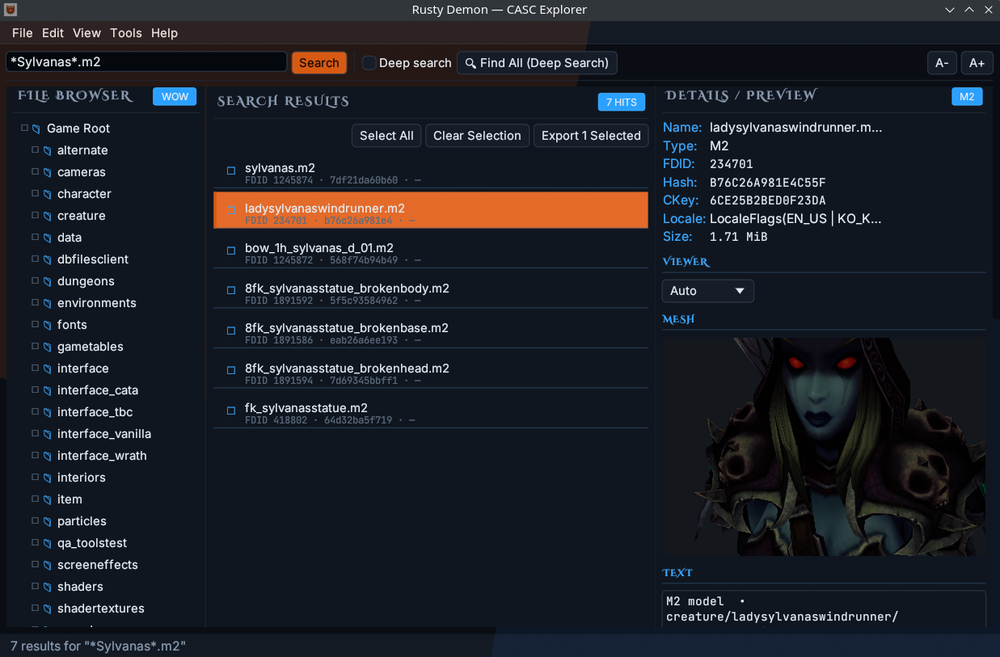
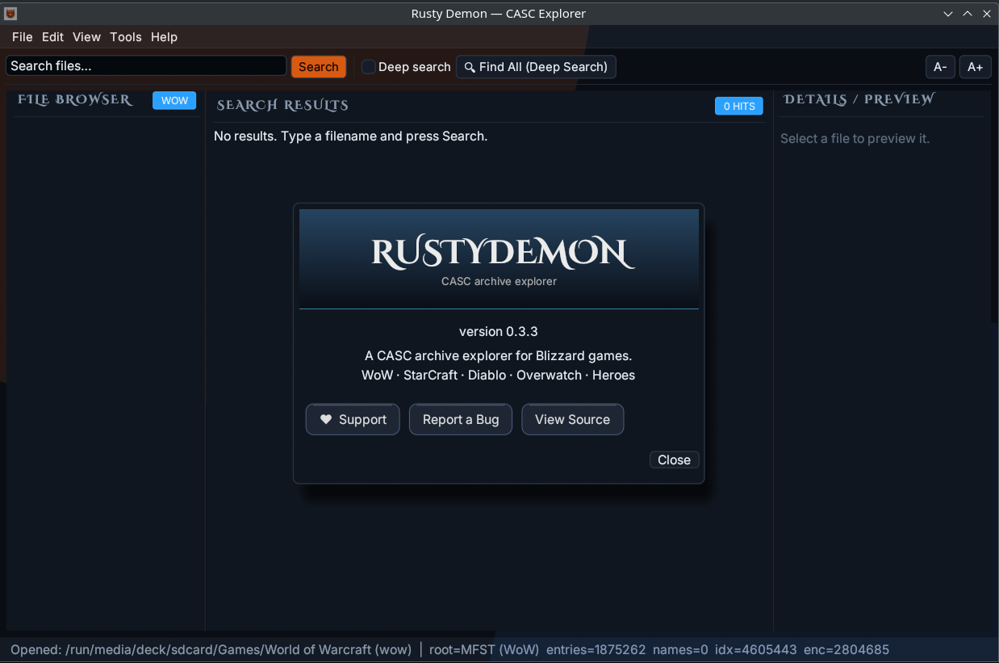
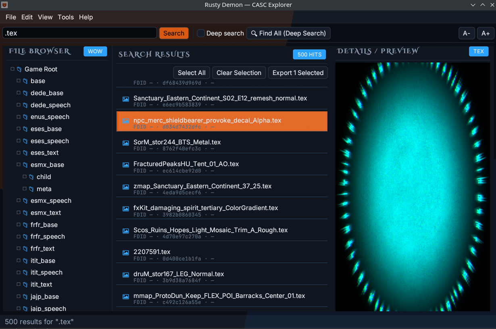
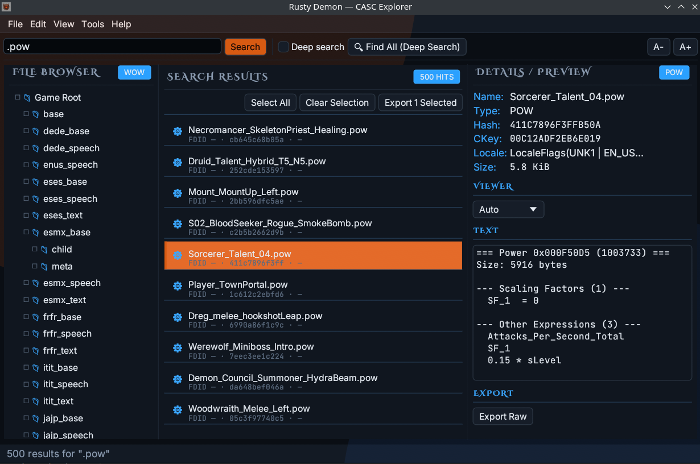

# Rusty Demon - Cross-Platform CASC Explorer

A fast, cross-platform explorer for CASC (Content-Addressable Storage Container)
archives, written entirely in Rust.

> **Rusty Demon adds first-class support for the Steam distribution of
> Diablo IV's CASC archives** alongside the existing Battle.net format. The
> Steam build's key-layout flag bits, zlib-wrapped VFS roots, and split
> meta.dat / payload.dat scheme are a layout the established Battle.net-era
> libraries don't yet cover — rustydemon handles them natively. See
> [Steam D4 Support](#steam-d4-support) below.

> **For personal and educational use only.**

[](https://github.com/HoldMyBeer-gg/rustydemon/actions/workflows/ci.yml)
[](https://www.rust-lang.org)
[](https://doc.rust-lang.org/edition-guide/rust-2021/index.html)
[](./LICENSE)
[](#preview-plugins)
[](#steam-d4-support)

---

## UI Preview



*Three-panel layout: archive tree (left) · search results (centre) · file details with live 3D preview (right). Shown here previewing a WoW M2 character model.*

---

## Preview Plugins

| About modal | D4 `.tex` texture |
|-------------|-------------------|
|  |  |

| D4 `.pow` skill data | WoW `.m2` model |
|----------------------|-----------------|
|  |  |

---

## Features

- **Regedit-style global search** - searches *every* entry in the archive manifest,
  not just the currently selected folder
- **File tree navigation** - browse archives by folder with expand/collapse, Expand All / Collapse All
- **Pluggable preview panel** - formats register themselves through a
  [`PreviewPlugin`](rustydemon/src/preview/mod.rs) trait. Built-in plugins
  cover BLP textures (WoW), `.tex` BC textures (D4), `.pow` skill data (D4),
  `.vid` Bink Video 2 movies (D4), and a generic UTF-8 text fallback. Add a
  format by dropping one file into `rustydemon/src/preview/`.
- **Pluggable export buttons** - each preview plugin can register its own
  export actions (e.g. *Export As PNG* for textures, *Export As BK2* for
  movies). Raw export is always available as a fallback.
- **Deep search** - optionally search *inside* container files via a parallel
  [`ContentSearcher`](rustydemon/src/deep_search/mod.rs) plug-in interface
  (`.pow` D4 skill data supported out of the box).
- **Glob path search** - search bar and CLI accept literal paths *or* glob
  patterns (`*.wmo`, `textures/*.tex`, `**/cinematics/*.vid`); matching is
  case-insensitive and `**/` is auto-prepended for convenience.
- **Headless CLI exporter** (`rustydemon-cli`) - batch-extract files from a
  local CASC install without launching the GUI. Supports path/glob/FDID
  selection, parallel workers, dry-run, flatten, and overwrite. See
  [CLI](#cli) below.
- **Auto product detection** - reads `.build.info` so you never need to know internal product codes (`fenris`, `wow`, etc.)
- **Cross-platform** - Windows · macOS · Linux · Steam Deck (touch-ready via egui)
- **Steam Diablo IV support** - native reader for the Steam-distribution
  static container format (no `.build.info`, no encoding file, location
  encoded directly in each EKey)
- **Diablo II: Resurrected support** - reads D2R 3.1.2's TVFS-based layout,
  including the multi-storage `Data/data` + `Data/ecache` split and
  archive-style `.index` files, with an optional CDN fallback fetcher
  (behind the `cdn` cargo feature).

---

## Steam D4 Support

Rusty Demon opens the Steam distribution of Diablo IV's CASC archives out
of the box. The Steam build ships with a fundamentally different storage
layout than the Battle.net client, and we wrote a dedicated backend for it
because the existing CASC libraries (which predate the Steam release) focus
on the Battle.net format:

| | Battle.net D4 | Steam D4 |
|---|---|---|
| Manifest entry point | `.build.info` | `Data/.build.config` |
| Archive files | `data.NNN` | `{chunk}/0x{archive}-{meta,payload}.dat` |
| Location lookup | `*.idx` index files | Bits inside each EKey |
| Encoding table | `encoding` file | *(none -CKey ≡ EKey)* |
| VFS root wrapper | BLTE | Raw zlib (`espec = z`) |
| Data header | 30-byte prefix | None |

Rustydemon auto-detects which layout is in use and picks the right backend.
Point **File → Open Game Directory…** at either
`C:\Program Files (x86)\Diablo IV` (Battle.net) or
`…/steamapps/common/Diablo IV` (Steam) and it just works.

> [CascLib](https://github.com/ladislav-zezula/CascLib) and
> [TACTLib](https://github.com/overtools/TACTLib) were our primary references
> for the CASC ecosystem, and TACTLib's static-container handler in particular
> guided rustydemon's understanding of the `key-layout-*` bit-extraction
> scheme used by Overwatch. The Steam D4 build extends that scheme with a
> few additional pieces — the 4th flag value in each `key-layout-*`, a
> zlib-wrapped VFS root, and a split `meta.dat` / `payload.dat` path layout —
> which rustydemon's `static_container` module in `rustydemon-lib` adds on
> top, verified against a real Steam install.

---

## Quick Start

### Prerequisites

| Platform | Requirement |
|----------|-------------|
| All | [Rust stable toolchain](https://rustup.rs) (1.80+) |
| Linux / Steam Deck | `libgtk-3-dev` (or equivalent) - see below |
| Windows / macOS | Nothing extra; eframe bundles everything |

**Linux / Steam Deck system deps:**

```bash
# Debian / Ubuntu / Kali
sudo apt install libgtk-3-dev libxcb-render0-dev libxcb-shape0-dev \
                 libxcb-xfixes0-dev libxkbcommon-dev libssl-dev

# Arch / Steam Deck
# Note: Just try to run rustydemon first. SteamOS probably has these already.
# If not, you'll have to `sudo steamos-readonly disable`, install, then 
# `sudo steamos-readonly enable` immediately after the install is done.
sudo pacman -S gtk3 libxcb xkbcommon openssl

# Fedora
sudo dnf install gtk3-devel libxcb-devel libxkbcommon-devel openssl-devel
```

> **Steam Deck (Desktop Mode):** SteamOS has very limited space outside `/home`, so install
> [Homebrew](https://brew.sh), `rustup`, and `gcc` to your SD card rather than the internal drive.
> Once Rust is available, install the Arch deps above via `pacman` and build normally.
> Game files live at `/home/deck/.steam/steam/steamapps/common/<Game>` -
> point **File → Open Game Directory…** there.

### Build & Run

```bash
git clone https://github.com/jabberwock/rustydemon.git
cd rustydemon
cargo run --release -p rustydemon
```

The first build downloads and compiles all dependencies (~3–5 minutes).
Subsequent builds are incremental and much faster.

---

## Usage Guide

### 1 -Open a game directory

**File → Open Game Directory…** and select your game's installation root
(the folder that contains `.build.info` for Battle.net installs, or
`Data/.build.config` for Steam installs).

The product UID is detected automatically:

| Game | Detected as |
|------|------------|
| World of Warcraft | `wow` |
| Diablo IV | `fenris` |
| Diablo II: Resurrected | `osi` |
| Diablo III | `d3` |
| Hearthstone | `hs` |
| Heroes of the Storm | `hero` |
| StarCraft II | `s2` |
| Overwatch | `pro` |

### 2 -Load a listfile *(optional but recommended)*

Without a listfile, files are shown by hash only.
With one, the full virtual path is resolved and the tree is populated.

**File → Load Listfile…** and pick a community listfile (CSV or plain text).
A maintained listfile can be downloaded from the
[wowdev community listfile](https://github.com/wowdev/wow-listfile) project.

### 3 -Search

Type a filename fragment in the search bar and press **Enter** or click **Search**.
Results are drawn from the *entire* root manifest, every locale and content
variant, so nothing is hidden behind an unexpanded folder.

The query can be a literal substring *or* a glob: `*.wmo`, `textures/*.tex`,
`**/cinematics/*.vid`. Matching is case-insensitive, and `**/` is
auto-prepended unless the pattern already anchors at `/` or `**/`.

### 4 -Deep search *(optional)*

Check **Deep search** and click **🔍 Find All (Deep Search)** to also search
*inside* supported container files:

| Format | What is indexed |
|--------|----------------|
| `.pow` | D4 skill/power definitions, SF names, damage formulas |
| *(more formats via the plug-in interface)* | |

### 5 -Preview and export

Click any file in the tree or search results to load it into the preview panel.

- **BLP textures** render inline
- **All other files** show a hex dump of the first 256 bytes
- **Export As PNG** saves a decoded BLP to disk via a native dialog

---

## CLI

`rustydemon-cli` is a headless batch exporter for scripting and
server-side extraction. The GUI binary remains the way to browse
interactively.

```bash
cargo run --release -p rustydemon-cli -- \
    --archive "/home/deck/.steam/steam/steamapps/common/Diablo IV" \
    --path    "base/meta/Sound" \
    --output  ./out
```

Key flags:

| Flag | Purpose |
|------|---------|
| `-a, --archive <DIR>` | Game install root (Battle.net or Steam) |
| `-p, --path <PATH>` | Literal folder, literal file, or glob (`*.wmo`, `**/cinematics/*.vid`) |
| `--fdid <N>` | Extract a single WoW file by FileDataID (no listfile needed) |
| `-l, --listfile <FILE>` | Listfile for WoW (required to resolve paths) |
| `-o, --output <DIR>` | Host directory; created if missing |
| `--flat` | Drop files into `--output` instead of mirroring virtual dirs |
| `--dry-run` | Print matches without writing |
| `--overwrite` | Replace existing files (default: skip) |
| `-j, --parallel <N>` | Worker thread count (defaults to CPU cores) |
| `-q, --quiet` | Suppress progress bar |

D4 and other TVFS-based archives self-describe, so `--listfile` is not
needed there. For WoW, pass either `--listfile` or `--fdid`.

---

## Encrypted Files & TACT Keys

Some files in Blizzard archives are encrypted. If one fails to open you'll see:

```
file is encrypted: missing TACT key C79F0F4C3715500A
```

The file is present and intact — only the decryption key is missing. Rusty Demon
ships the public key set (Overwatch, WoW), but Blizzard streams keys for some
titles at runtime and rotates them, so newer content may need keys you supply
yourself.

Drop them in a plain text file, one key per line, in the standard
[wowdev format](https://github.com/wowdev/TACTKeys):

```
# KEYNAME (16 hex) KEYVALUE (32 hex)
C79F0F4C3715500A 000102030405060708090A0B0C0D0E0F
```

Rusty Demon loads this file automatically at startup from:

| Platform | Path |
| --- | --- |
| Linux | `$XDG_CONFIG_HOME/rustydemon/tact.keys`, else `~/.config/rustydemon/tact.keys` |
| macOS | `~/Library/Application Support/rustydemon/tact.keys` |
| Windows | `%APPDATA%\rustydemon\tact.keys` |

Set `RUSTYDEMON_TACT_KEYS=/path/to/file` to override the location entirely.

You can also load a key file at any time via **File → Load TACT Keys…** in the
GUI, or `--tact-keys <FILE>` on the CLI. Keys loaded this way apply to the
already-open archive immediately — no need to reopen it.

---

## Workspace Layout

```
rustydemon/
├── rustydemon-blp2/   BLP0/1/2 texture decoder (palette, DXT1/3/5, ARGB, JPEG)
├── rustydemon-lib/    CASC library (config, index, encoding, BLTE, root, search)
├── rustydemon-cli/    Headless batch exporter (clap + rayon)
└── rustydemon/        egui/eframe GUI application
```

---

## Contributing

1. Fork and create a feature branch
2. `cargo test --workspace` must pass
3. `cargo fmt --all` and `cargo clippy --workspace -- -D warnings` must be clean
4. Open a PR - CI runs fmt, clippy, tests, and a RustSec security audit automatically

Listfile improvements and new deep-search plug-ins are especially welcome.

---

## Acknowledgments

Built on the shoulders of the CASC reverse-engineering community:

- **[CascLib](https://github.com/ladislav-zezula/CascLib)** by Ladislav
  Zezula - the C library for reading CASC archives and our primary reference
  for BLTE, encoding, root manifests, MNDX/MARR, and more.
- **[CASC Explorer](https://github.com/WoW-Tools/CASCExplorer)** by the
  WoW-Tools team - the original .NET GUI for browsing CASC archives.
  Rusty Demon's UI takes cues from CASC Explorer's design.
- **[TACTLib](https://github.com/overtools/TACTLib)** by the Overtools team -
  a C# CASC implementation whose TVFS and static-container work was a useful
  reference.
- **[SereniaBLPLib](https://github.com/WoW-Tools/SereniaBLPLib)** by Xalcon -
  BLP texture parsing and DXT decompression in `rustydemon-blp2` are derived
  from this MIT-licensed C# library (see
  [`rustydemon-blp2/CREDITS`](rustydemon-blp2/CREDITS)).
- **[wowdev.wiki](https://wowdev.wiki/CASC)** and the datamining community -
  for documenting CASC/TACT formats and maintaining the community listfiles.

---

## License

Source licensed under [AGPL-3.0](./LICENSE) with the Commons Clause -
free to read, build, and use for personal and educational purposes.

Commercial distribution (e.g. Steam store builds) is reserved to the
maintainers under a separate proprietary license. See
[COMMERCIAL.md](./COMMERCIAL.md) for the dual-licensing details and the
contributor license grant that applies to pull requests.
